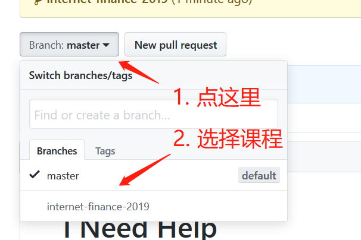
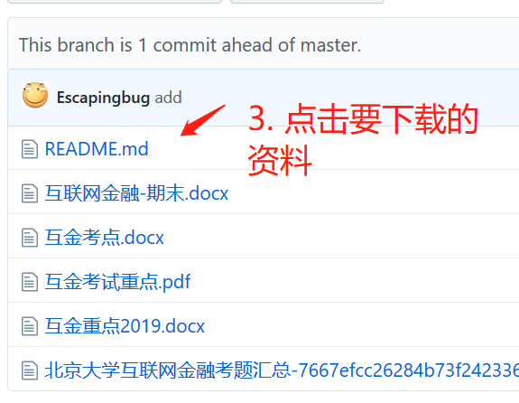
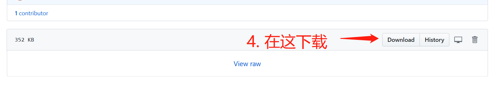
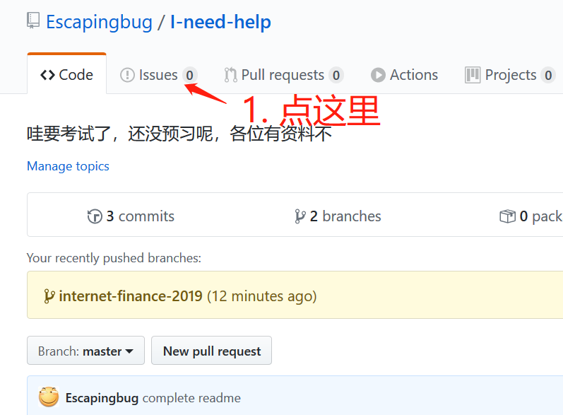
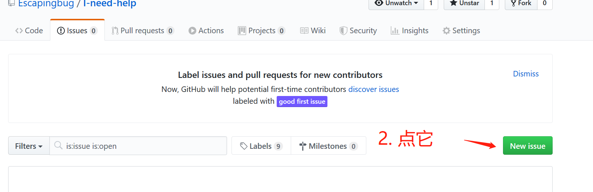
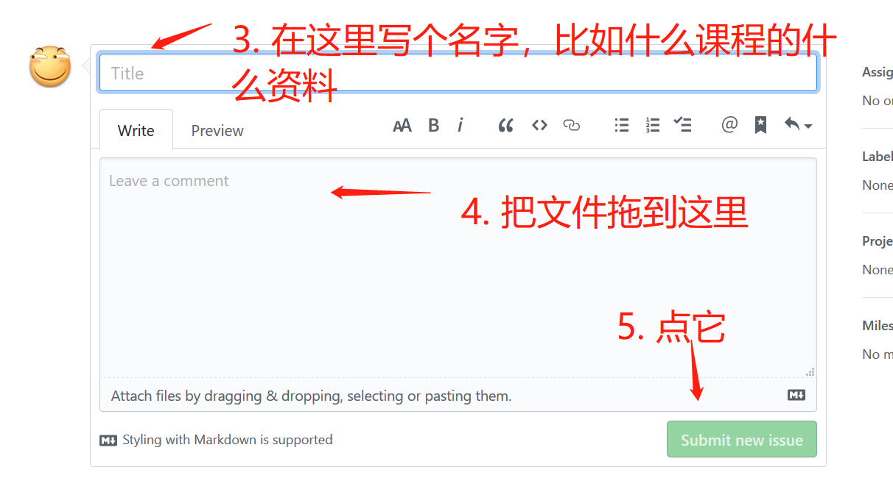

# I Need Help

HELP! Final exam is coming in 3 days! I haven't read a single word till now.

救命！要考试了，啥都不会，还没预习，咋办！

这个 repo 就是你的救命稻草！

来大家一起建设，把你能找到的课程复习资料都发上来吧！

## 用法

### 我不会用 git 咋办呀

如何快速下载：

1. 找到网站中的 `Branch: master` 按钮，点击，可以看到所有的课程选项
2. 选择想要查看的课程，其中包含资料





### 我很牛逼，会用 git

为了避免一次性 clone ，每一个课程对应一个 remote branch 。 master 分支为介绍分支，不保存任何内容。

如何下载一个课程所有资料到本地：

```
git clone -b 本地分支名 远程分支名
```

如果没有 git ，你需要单独下载每一个资料。

其中远程分支名对应课程名，可以在 github 上查看现有的课程名。

## 我想要提交我找到的新资料！

### 我不会用 git 啊，咋弄啊





### 我会用 git ！

给特定 branch 开一个 pull request 即可。
